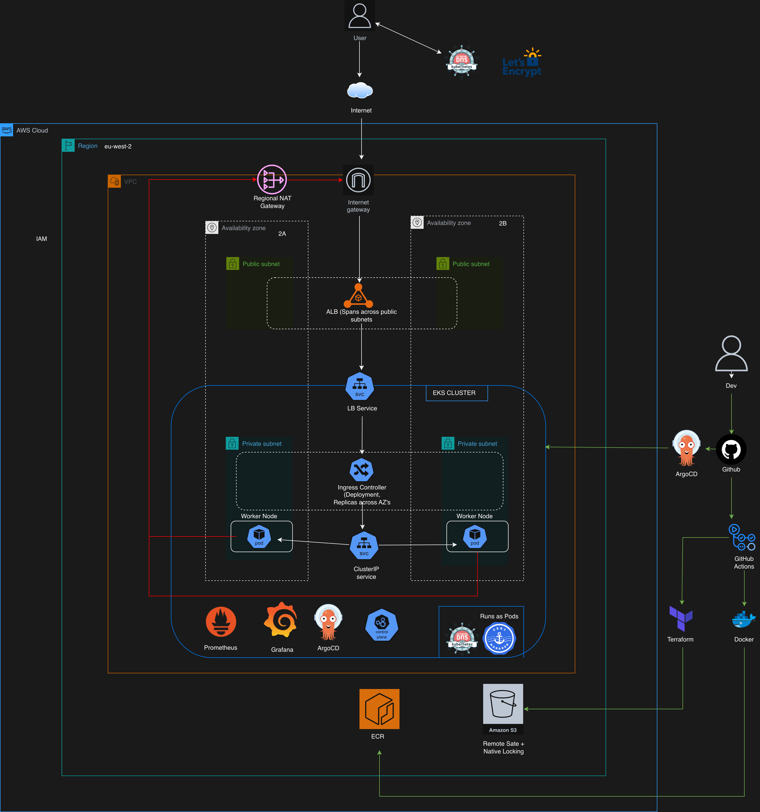

# ClusterCore - GitOps Driven Platform on Amazon EKS

Built an **end-to-end production-grade Kubernetes platform on Amazon EKS** with fully automated **GitOps deployments**, where pushing a Docker image triggers a **Git update → ArgoCD sync → live deployment**, eliminating manual intervention and ensuring consistent, reliable releases.

This project demonstrates a **production-grade deployment of a cloud-native application on Amazon EKS**, with **all infrastructure provisioned using Terraform**, **GitOps automation via ArgoCD**, and a **fully automated CI/CD pipeline using GitHub Actions**.

The setup follows modern DevOps best practices: modular Infrastructure as Code, private networking, GitOps-based deployments, secure image delivery, HTTPS via automated TLS, dynamic DNS, and full observability.


## Architecture Overview



### Live Deployment 


https://github.com/user-attachments/assets/229ff266-f237-45b6-a001-928e261a1c19


### Deployment Verification

- [View ArgoCD Healthy Application](./assets/argocd-healthy.png)
- [View Grafana Dashboard - Cluster ](assets/eks-cluster-dashboard.png)
- [View Grafana Dashboard - Nodes ](./assets/eks-nodes-dashboard.png)
- [View Prometheus Runtime](./assets/prometheus-runtime.png)
- [View Healthy App](./assets/healthy-app.png)


## Architecture Summary

The architecture is designed for **high availability, security, and scalability**:

- Multi-AZ VPC with public and private subnets  
- Amazon EKS cluster running in private subnets  
- **Traefik Ingress Controller** for external traffic routing  
- HTTPS enabled via CertManager (Let’s Encrypt)  
- Dynamic DNS updates via ExternalDNS  
- GitOps deployments via ArgoCD  
- Container images stored in private Amazon ECR  
- Observability with Prometheus and Grafana  


## Repository Structure

```text
eks/
├── .github/workflows
│    ├──  apply.yaml
│    ├──  bootstrap.yaml
│    ├── build+push.yml
│    ├── destroy.yml
│    ├── install-argocd.yaml
│    └── plan.yaml
│
├── app
│   ├── Dockerfile
│   ├── .dockerignore
│   └── ...
│
├── argocd
│    ├── apps
│    │    ├── cert-manager.yaml
│    │    ├── clusterissuer.yaml
│    │    ├── eks-app.yaml
│    │    ├── external-dns.yaml
│    │    ├── monitoring.yaml
│    │    └── traefik-ingress.yaml
│    └── root-app.yaml
│
├── assets
│    ├── argocd-healthy.png
│    ├── eks-architecture.png
│    ├── grafana-cluster-dashboard.png
│    ├── grafana-nodes-dashboard.png
│    ├── healthy-app.png
│    └── running dashboard.png
│
├── helm/eks-app
│    ├── templates
│    │    ├── deployment.yaml
│    │    ├── ingress.yaml
│    │    └── service.yaml
│    │ 
│    ├── .helmignore
│    ├── Chart.yaml
│    └── values.yaml
│
├── infra
│    ├── bootstrap
│    │    ├── main.tf
│    │    ├── provider.tf
│    │    ├── variables.tf
│    │    └── versions.tf
│    │ 
│    ├── modules 
│    │    ├── eks 
│    │    │    ├── main.tf
│    │    │    ├── outputs.tf 
│    │    │    └── variables.tf
│    │    │ 
│    │    ├── iodc 
│    │    │    ├── locals.tf
│    │    │    ├── main.t
│    │    │    ├── outputes.tf
│    │    │    └── variables.tf
│    │    │
│    │    └── vpc
│    │        ├── main.tf
│    │        ├── outputs.tf 
│    │        └── variables.tf 
│    │ 
│    ├── backend.tf
│    ├── main.tf 
│    ├── outputs.tf
│    ├── provider.tf 
│    ├── terraform.tfvars 
│    ├── variables.tf 
│    └── versions.tf
│
├── .gitignore
├── pre-commit-config.yaml
└── README.md

```


## Infrastructure Components

### Networking
- Custom **VPC** across multiple Availability Zones  
- **Public subnets** for ingress traffic  
- **Private subnets** for EKS nodes  
- NAT Gateways for outbound connectivity  
- Security groups scoped by least privilege  

### Kubernetes (EKS)
- **Amazon EKS cluster** provisioned via Terraform  
- Managed node groups  
- Workloads deployed via Helm  
- Namespaced isolation  

### Ingress & Traffic Routing
- **Traefik Ingress Controller**
- Routes external traffic into the cluster  
- Host-based routing  
- Integrated TLS termination  

### TLS & Certificates
- **CertManager**  
- Automatic certificate provisioning via **Let’s Encrypt**  
- Fully automated HTTPS  

### DNS Automation
- **ExternalDNS**
- Dynamically manages Route53 records  
- Syncs directly with Kubernetes ingress  

### GitOps Deployment
- **ArgoCD**
- Declarative deployments from Git  
- Continuous reconciliation of cluster state  
- Automatic sync on repository changes  

### Observability
- **Prometheus** for metrics  
- **Grafana** dashboards  
- Cluster + application visibility  

### State Management
- Remote Terraform state in S3  
- State locking s3 native state locking  

---

## CI/CD Pipeline (GitHub Actions)

The project uses a **multi-stage, chained CI/CD pipeline**, where each workflow is triggered only after the previous one succeeds. This ensures **safe, validated, and sequential delivery** of infrastructure and application changes.


### 1. Build & Push Docker Image (Manual Trigger)

Triggered via `workflow_dispatch` with confirmation input:

- Builds Docker image from `/app`
- Tags image using Git commit SHA
- Pushes image to **Amazon ECR**
- Runs **Trivy** vulnerability scan (non-blocking)
- Publishes scan results as an artifact  

**GitOps Trigger Step:**
- Updates Helm `values.yaml` with new image tag  
- Commits and pushes changes to repository  
- Uses `git pull --rebase` before push to avoid conflicts  

This step is the **entry point of the entire pipeline**.


### 2. Plan Infrastructure (Auto Trigger)

Triggered automatically after successful image build:

- Runs `terraform fmt`, `validate`, and `init`
- Runs **TFLint** for linting
- Runs **Checkov** for IaC security scanning
- Generates Terraform execution plan  

Ensures infrastructure is **valid, secure, and ready** before applying changes.


### 3. Apply Infrastructure

Triggered after successful plan:

- Applies Terraform changes (`terraform apply`)
- Updates infrastructure safely  

Post-deployment:
- Configures `kubeconfig` for cluster access  
- Creates Kubernetes secret for **Cloudflare API token**  
  - Required for **CertManager DNS validation**


### 4. ArgoCD Installation & Bootstrap

Triggered after infrastructure is ready:

- Installs ArgoCD into the cluster  
- Exposes ArgoCD via LoadBalancer  
- Waits for ArgoCD API readiness  
- Deploys **root ArgoCD application** (GitOps entrypoint)  

Additional setup:
- Waits for `cert-manager` namespace  
- Copies Cloudflare token secret into correct namespace  

At this stage:
→ **GitOps takes over all application deployments**


### 5. Continuous Deployment (GitOps Flow)

After initial setup:

- Any change to Helm values or manifests (e.g. new image tag)  
- ArgoCD detects drift between Git and cluster  
- Automatically syncs desired state  

No manual `kubectl apply` is required.


### 6. Destroy Pipeline (Manual)

Triggered via `workflow_dispatch`:

- Runs `terraform destroy`  
- Fully tears down infrastructure  


## CI/CD Design Highlights

- **Chained workflows using `workflow_run`**
- Manual approval gate for critical actions  
- **Git commit → ArgoCD sync** pattern (true GitOps)  
- No long-lived AWS credentials (**OIDC used**)  
- Security scanning integrated early in pipeline  
- Infrastructure and application delivery fully automated  


## Tech Stack

### Infrastructure & Cloud
- **AWS**: EKS, VPC, EC2, IAM, ECR, S3, DynamoDB  
- **Terraform**

### Kubernetes Ecosystem
- **Kubernetes (EKS)**
- **Helm**
- **ArgoCD**
- **Traefik**
- **CertManager**
- **ExternalDNS**

### CI/CD & Security
- **GitHub Actions**
- **OIDC**
- **Trivy**
- **Checkov**
- **TFLint**

### Observability
- **Prometheus**
- **Grafana**

### Application
- **Docker**


## Terraform Design

- Fully **modular architecture**
- Separation of concerns:
  - Networking
  - Cluster
  - IAM
  - Security  
- Remote state with locking  
- Reusable modules  
- Explicit dependencies  


## Run Locally

### Prerequisites
- Docker  
- AWS CLI (optional)  
- kubectl (optional)  
- Helm (optional)  


### 1. Run the Application (Docker)

```bash
# Build the image
docker build -t eks-app:local ./app
```
```bash
# Run the container
docker run -p 8080:8080 eks-app:local
```

App will be available at :
- http://localhost:8080 


## Security Considerations

- No secrets in version control  
- Private workloads  
- Least privilege IAM  
- TLS enforced via CertManager  
- Continuous scanning in CI/CD  
- GitOps prevents configuration drift  


## Key Learnings

- Building **production-grade Kubernetes platforms on EKS**  
- Implementing **GitOps with ArgoCD**  
- Designing **end-to-end automated CI/CD pipelines**  
- Managing **Ingress controllers (Traefik)**  
- Automating **DNS + TLS inside Kubernetes**  
- Observability across distributed systems  


## Future Improvements

- Horizontal Pod Autoscaler (HPA)  
- Cluster Autoscaler  
- Blue/Green or Canary deployments  
- WAF integration  
- Multi-environment support  
- Service mesh (Istio/Linkerd)  

